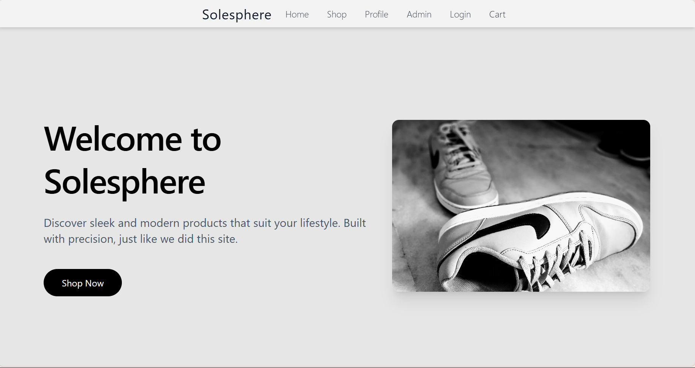
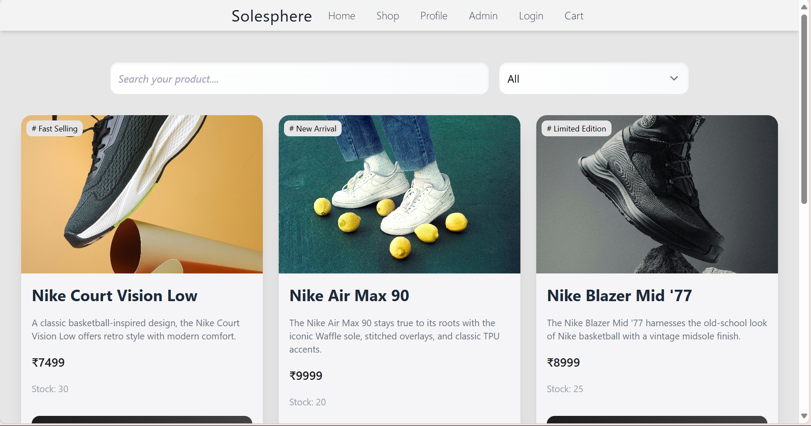

# 🧼 SoleSphere - E-commerce Shoe Store

SoleSphere is a full-stack e-commerce web application for premium footwear. Built with the **MERN stack**, it offers a clean and responsive shopping experience with user authentication, cart management, and order handling.

---

## 🚀 Features

- 🛍️ **Product Catalog**: Browse and filter shoes by categories.
- 🛒 **Add to Cart**: Persistent cart using React state and local storage.
- 👤 **User Authentication**: Secure sign-up and login using JWT.
- 📦 **Order Management**: Users can place and view orders.
- 🧭 **Dynamic Routing**: React Router for navigation with 404 handling.
- ☁️ **Cloud Deployment**: Frontend on Vercel, Backend on Render.

---

## 🧰 Tech Stack

| Frontend  | Backend     | Database | Deployment |
|-----------|-------------|----------|------------|
| React.js  | Node.js     | MongoDB  | Vercel     |
| Tailwind CSS | Express.js |          | Render     |
| Vite      | JWT         |          |            |

---

## 📸 Screenshots

---

